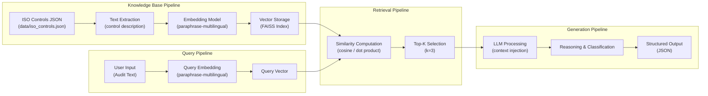
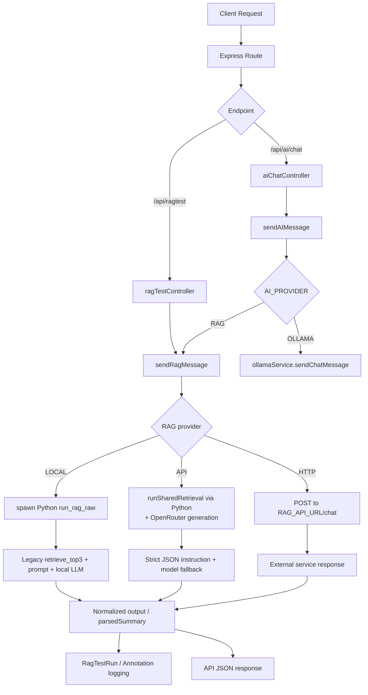

# Comparative Technical Audit of RAG Architecture  
**Legacy Pipeline vs NovaTrix Integrated Backend**

## Scope and Context

- **Legacy RAG Pipeline**: `D:\Hilmi\Coding\MasterFolderSkripsi\RAG\rag\iso_rag_project`
- **Current Integrated Backend**: `D:\Hilmi\Coding\MasterFolderSkripsi\NovaTrix\backend`
- Objective: produce an academically usable, end-to-end technical audit of architecture, retrieval mechanics, LLM integration, and engineering trade-offs.

---

## Section 1 — Full RAG Architecture (Rewrite & Complete)

## A. Legacy System (`iso_rag_project`)

### 1) System Architecture Overview

Legacy is a **standalone Python RAG classifier** focused on ISO 27001 Annex A mapping. The execution path is linear and tightly coupled:

1. Receive audit sentence input  
2. Embed query (SentenceTransformer)  
3. Retrieve top-k (FAISS)  
4. Inject retrieved controls into prompt template  
5. Call local Ollama model  
6. Parse/validate JSON output  

Primary modules:

- `rag/rag_pipeline.py` — orchestration (retrieve → prompt build → LLM call)
- `retrieval/retrieve.py` — FAISS retrieval logic (`retrieve_top_k`, `retrieve_top3`)
- `embedding/embedding_model.py` — embedding model loader + encoders
- `embedding/build_index.py` — index build pipeline from controls JSON
- `llm/llm_wrapper.py` — Ollama call, JSON extraction, response validation
- `llm/prompt_template.txt` — system-style instruction template

### 2) Knowledge Base Pipeline

- **Knowledge source**: `data/iso_controls.json`
- **Data type**: structured JSON records for ISO controls (e.g., `control_id`, `title`, `objective`, `description`, `implementation_guidance`)
- **Ingestion style**: direct load from JSON (no OCR/parser stage)
- **Unit of retrieval**: one semantic unit per control record
- **Chunking**: effectively **control-level chunking**; no variable token chunker or overlap logic

### 3) Embedding Pipeline

- Model: `paraphrase-multilingual-MiniLM-L12-v2`
- Embedding dim: `384`
- Local inference via `sentence-transformers`
- Index-time representation: concatenation of `title | objective | description` per control
- Query-time representation: raw user sentence
- Normalization: L2 normalization before indexing/search for cosine-like scoring with inner product

### 4) Vector Storage

- Store: FAISS binary index (`data/faiss_index.bin`)
- Index type: `IndexFlatIP`
- Metadata: `data/index_metadata.json`
  - contains model name, dim, number of controls, list of control IDs, index type, normalization notes
- Persistence: file-based local artifact, reused across runs

### 5) Retrieval Mechanism

- Retrieval type: dense semantic retrieval
- Similarity: inner product over normalized vectors (cosine-equivalent behavior)
- Top-k: default k=3 (`retrieve_top3`)
- Filtering: no metadata filter/rule filter stage
- Reranking: absent

### 6) LLM Usage

- Provider: local Ollama API (`/api/generate`)
- Default model in wrapper: `qwen2.5:3b`
- Prompt composition:
  - base template from `prompt_template.txt`
  - injected top-3 retrieved controls
  - strict instruction to answer with single JSON schema
- LLM role: classification and structured justification generation grounded in retrieved evidence

### 7) Output Generation

- Expected schema:
  - `control_id`
  - `applicable`
  - `implementation_status`
  - `justification`
  - `recommendation`
- Post-processing in `llm_wrapper.py`:
  - robust JSON extraction from raw text
  - required key checks
  - enum normalization/validation
  - control ID pattern validation
- Additional runtime metadata:
  - retrieved controls and similarity scores attached by pipeline layer

---

## B. NovaTrix Backend (`backend`)

### 1) System Architecture Overview

NovaTrix backend is a **Node.js orchestration layer** that integrates RAG into a full web backend with authentication, persistence, and provider switching.

Core RAG integration points:

- `src/controllers/ragTestController.js`
- `src/controllers/aiChatController.js`
- `src/routes/ragtest.routes.js`
- `src/services/ragService.js`
- `src/services/ollamaService.js`

Execution modes inside `ragService.js`:

1. **LOCAL**: spawn Python and call legacy pipeline (`run_rag_raw`)
2. **API**: run shared legacy retrieval, then call OpenRouter for generation
3. **HTTP**: call external RAG service via `RAG_API_URL`

### 2) Knowledge Base Pipeline

NovaTrix maintains **two knowledge representations**:

1. **Operational retrieval knowledge**: legacy `iso_controls.json` + FAISS in external legacy project path (`RAG_PROJECT_PATH`)  
2. **Application domain dataset**: Prisma `AnnexAControl` seeded from `src/prisma/data/annexAControls2022.js`

Important distinction:

- The active retrieval path in current implementation is still tied to legacy FAISS pipeline.
- AnnexAControl DB data is used for app workflows, tagging, dashboards, and compliance lifecycle, not as current vector retriever.

### 3) Embedding Pipeline

- No native Node embedding/index build path in backend service
- Embedding/retrieval delegated to legacy Python modules in LOCAL/API retrieval stage
- Therefore, NovaTrix inherits:
  - model choice
  - embedding granularity
  - FAISS setup

### 4) Vector Storage

- Active vector store: legacy FAISS files referenced through Python bridge
- Backend-native vector DB (pgvector/Chroma/Pinecone/FAISS in Node): not present
- Backend persistence focus: run logs and outputs in Prisma tables (`RagTestRun`, annotation RAG fields)

### 5) Retrieval Mechanism

- LOCAL/API retrieval: delegated to legacy `retrieve_top3`
- HTTP retrieval: delegated externally to remote RAG API endpoint
- Top-k and metric in LOCAL/API: same as legacy (top-3, normalized IP similarity)
- Reranking: absent in backend orchestration

### 6) LLM Usage

Two service layers exist:

- `ollamaService.js`: generic AI chat service and provider switch (`AI_PROVIDER=OLLAMA|RAG`)
- `ragService.js`: RAG orchestration (retrieval bridge + OpenRouter path + external API path + local legacy path)

Model/provider options:

- Local pipeline model (inherited from legacy wrapper)
- OpenRouter model (default from env, with fallback models)
- Optional external RAG API provider via `RAG_API_URL`

### 7) Output Generation

`ragService.js` includes strict output hardening:

- JSON extraction from mixed text
- enum normalization (`Yes/No`, implementation status)
- control ID fallback to top retrieved control if invalid
- standardized parsed summary attached to API response

Persistence and observability:

- `RagTestRun` table logs status, output text, elapsed time, provider, error message, detailed logs
- Annotation records can store RAG raw output, elapsed time, status, predicted control ID

---

## Section 2 — System Flow Diagrams (Mandatory)

## 1) Legacy RAG Flow

### Legacy flow notes

- **Knowledge input flow**: JSON controls → embedding → FAISS + metadata
- **Query flow**: user text → query embedding
- **Retrieval flow**: vector similarity search top-3
- **LLM processing**: prompt contains retrieved controls + strict JSON instructions
- **Output generation**: parsed and validated structured object

### Legacy box-by-box explanation (A1–D3)

#### A1 — ISO Controls JSON (`data/iso_controls.json`)
- **Source files (affiliated):**
  - `data/iso_controls.json`
  - `embedding/build_index.py` (loads this file)
  - `retrieval/retrieve.py` (loads again for mapping result index → control record)
- **Process/computing:**
  - Structured ISO controls are read into memory as Python objects.
  - No SQL DB is used in legacy retrieval path.
  - Acts as canonical text corpus and result payload source.

#### A2 — Text Extraction (control text preparation)
- **Source files (affiliated):**
  - `embedding/embedding_model.py` (`encode_control`)
  - `embedding/build_index.py` (calls `encode_control` in loop)
- **Process/computing:**
  - For each control, text is assembled as: `title | objective | description`.
  - Note: diagram says “control description”, but implementation uses three fields, not only description.
  - This assembled text becomes one semantic indexing unit per control.

#### A3 — Embedding Model (`paraphrase-multilingual-*`)
- **Source files (affiliated):**
  - `embedding/embedding_model.py` (`get_model`, `encode_texts`, `encode_control`)
- **Process/computing:**
  - Model loaded via SentenceTransformer: `paraphrase-multilingual-MiniLM-L12-v2`.
  - Outputs 384-d vectors (`float32`).
  - Vectors are L2-normalized before indexing/query search.

#### A4 — Vector Storage (FAISS Index)
- **Source files (affiliated):**
  - `embedding/build_index.py` (creates/saves index)
  - `retrieval/retrieve.py` (`faiss.read_index`)
  - `data/faiss_index.bin`, `data/index_metadata.json`
- **Process/computing:**
  - Index type: `faiss.IndexFlatIP`.
  - All control vectors are added and persisted to binary file.
  - Metadata stores model/dim/index type/control IDs for traceability.

#### B1 — User Input (Audit Text)
- **Source files (affiliated):**
  - `rag/rag_pipeline.py` (`run_rag`, `run_rag_raw`, CLI `main`)
  - `query.py` (interactive retrieval-only query)
- **Process/computing:**
  - Raw sentence is accepted as runtime query string.
  - No query rewrite/decomposition stage is applied.

#### B2 — Query Embedding
- **Source files (affiliated):**
  - `retrieval/retrieve.py` (`query_embedding = encode_texts([query])`)
  - `embedding/embedding_model.py` (`encode_texts`)
- **Process/computing:**
  - Query text encoded using same embedding model as KB vectors.
  - Output normalized to unit-length vector.

#### B3 — Query Vector
- **Source files (affiliated):**
  - `retrieval/retrieve.py` (uses query vector for search)
- **Process/computing:**
  - Final vector shape is `(1, 384)` float32.
  - Passed directly to FAISS `index.search(...)`.

#### C1 — Similarity Computation (cosine/dot product)
- **Source files (affiliated):**
  - `embedding/build_index.py` (L2 normalization + `IndexFlatIP`)
  - `embedding/embedding_model.py` (query normalization)
  - `retrieval/retrieve.py` (`scores, indices = index.search(query_embedding, k)`)
- **Process/computing:**
  - Similarity computed by FAISS inner product against all stored vectors.
  - Because both KB and query vectors are normalized, this is cosine-equivalent scoring.
  - Returns ranked scores and vector indices.

#### C2 — Top-K Selection (`k=3`)
- **Source files (affiliated):**
  - `retrieval/retrieve.py` (`retrieve_top_k`, `retrieve_top3`)
- **Process/computing:**
  - `retrieve_top3` calls `retrieve_top_k(..., k=3)`.
  - Top 3 highest-similarity hits are selected.
  - Each hit is mapped back to control text fields + score.

#### D1 — LLM Processing (context injection)
- **Source files (affiliated):**
  - `rag/rag_pipeline.py` (`build_rag_prompt`)
  - `llm/prompt_template.txt`
  - `retrieval/retrieve.py` (`format_retrieved_for_prompt`)
- **Process/computing:**
  - LLM receives text prompt containing:
    - base ISO instruction template
    - retrieved top-3 control snippets (text, not vectors)
    - original audit sentence
    - strict JSON-only response constraint

#### D2 — Reasoning & Classification
- **Source files (affiliated):**
  - `llm/llm_wrapper.py` (`call_ollama`, `query_llm_raw`, `query_llm`)
- **Process/computing:**
  - Ollama model performs instruction-following classification grounded in provided context.
  - It decides control mapping/applicability/status and generates justification/recommendation.

#### D3 — Structured Output (JSON)
- **Source files (affiliated):**
  - `llm/llm_wrapper.py` (`extract_json`, `validate_response`)
  - `rag/rag_pipeline.py` (attaches `_retrieved_controls`)
- **Process/computing:**
  - Raw model text is parsed into JSON using robust extraction logic.
  - Output is validated/normalized against required schema.
  - Final structured object is returned to caller.

---

## 2) NovaTrix RAG Flow

### NovaTrix flow notes

- **Knowledge input flow**:
  - operational retrieval knowledge comes from legacy project (JSON + FAISS)
  - app-side control data in Prisma from `annexAControls2022.js`
- **Query flow**: API request enters controller; provider routing determines pipeline
- **Retrieval flow**: LOCAL/API use legacy dense top-3 retrieval, HTTP delegated
- **LLM processing**: local legacy model or OpenRouter depending on mode
- **Output generation**: normalized JSON, persisted logs, API response envelope

### NovaTrix box-by-box explanation (A1–D3)

#### A1 — ISO Controls JSON (`data/iso_controls.json`, via legacy path)
- **Source files (affiliated):**
  - `backend/src/services/ragService.js` (`defaultRagProjectPath`, `getRagProjectPath`, Python wrappers)
  - `RAG\rag\iso_rag_project\data\iso_controls.json`
  - `RAG\rag\iso_rag_project\retrieval\retrieve.py` (loads controls JSON)
- **Process/computing:**
  - NovaTrix does not parse this JSON directly in Node.
  - Node delegates retrieval to Python wrapper, which loads legacy controls corpus.
  - This is operational retrieval KB for LOCAL/API retrieval path.

#### A2 — Text Extraction (control text preparation)
- **Source files (affiliated):**
  - `RAG\rag\iso_rag_project\embedding\embedding_model.py` (`encode_control`)
  - `RAG\rag\iso_rag_project\embedding\build_index.py`
- **Process/computing:**
  - Legacy indexing logic assembles `title | objective | description` per control.
  - NovaTrix reuses this precomputed representation indirectly through legacy index.
  - No backend-native text-to-chunk extraction is implemented in Node.

#### A3 — Embedding Model (`paraphrase-multilingual-*`, reused)
- **Source files (affiliated):**
  - `RAG\rag\iso_rag_project\embedding\embedding_model.py`
  - `backend/src/services/ragService.js` (calls Python retrieval wrappers that invoke embedding path)
- **Process/computing:**
  - Query embedding for LOCAL/API retrieval is produced in legacy Python, not in Node.
  - Same SentenceTransformer model and normalization behavior are reused.

#### A4 — Vector Storage (FAISS Index, reused)
- **Source files (affiliated):**
  - `RAG\rag\iso_rag_project\data\faiss_index.bin`
  - `RAG\rag\iso_rag_project\data\index_metadata.json`
  - `RAG\rag\iso_rag_project\retrieval\retrieve.py`
  - `backend/src/services/ragService.js` (`runSharedRetrieval`, `runLocalRag`)
- **Process/computing:**
  - Retrieval index is persisted in legacy project filesystem.
  - NovaTrix accesses it by running Python in `RAG_PROJECT_PATH`.
  - No separate backend vector DB/index is built in current code.

#### B1 — User Input (Audit Text)
- **Source files (affiliated):**
  - `backend/src/controllers/ragTestController.js` (`query` input)
  - `backend/src/controllers/aiChatController.js` (`message` input)
  - `backend/src/routes/ragtest.routes.js`
- **Process/computing:**
  - Request payload validated in controller.
  - Routed to `sendRagMessage` directly (`/api/ragtest`) or indirectly via `sendAIMessage` (`/api/ai/chat` when provider is RAG).

#### B2 — Query Embedding (delegated)
- **Source files (affiliated):**
  - `backend/src/services/ragService.js` (`runSharedRetrieval` Python wrapper)
  - `RAG\rag\iso_rag_project\retrieval\retrieve.py` (`encode_texts([query])`)
- **Process/computing:**
  - Node passes query text to Python through stdin.
  - Python computes embedding using legacy model.
  - For HTTP mode (`RAG_API_URL`), embedding occurs in external service (not visible in this repo).

#### B3 — Query Vector
- **Source files (affiliated):**
  - `RAG\rag\iso_rag_project\retrieval\retrieve.py`
- **Process/computing:**
  - Query vector is generated in Python runtime and directly consumed by FAISS `search`.
  - Vector is not persisted in DB by NovaTrix; only final run logs are persisted.

#### C1 — Similarity Computation (cosine/dot product)
- **Source files (affiliated):**
  - `RAG\rag\iso_rag_project\retrieval\retrieve.py` (`index.search`)
  - `RAG\rag\iso_rag_project\embedding\embedding_model.py` (normalization)
  - `RAG\rag\iso_rag_project\embedding\build_index.py` (`IndexFlatIP`)
- **Process/computing:**
  - Similarity is computed in FAISS (inner product on normalized vectors).
  - Equivalent behavior to cosine ranking.
  - NovaTrix consumes returned `scores` and `indices` as retrieval outputs.

#### C2 — Top-K Selection (`k=3`)
- **Source files (affiliated):**
  - `RAG\rag\iso_rag_project\retrieval\retrieve.py` (`retrieve_top3`)
  - `backend/src/services/ragService.js` (`runSharedRetrieval`, `runLocalRag`)
- **Process/computing:**
  - Top-3 controls are selected from similarity-ranked candidates.
  - Returned to Node as structured list with control text and score.
  - Same top-3 policy used in LOCAL and API retrieval pre-step.

#### D1 — LLM Processing (context injection)
- **Source files (affiliated):**
  - `RAG\rag\iso_rag_project\rag\rag_pipeline.py` (`build_rag_prompt`)
  - `backend/src/services/ragService.js` (`runOpenRouterRag`, strict JSON instruction append)
  - `RAG\rag\iso_rag_project\llm\prompt_template.txt`
- **Process/computing:**
  - LLM input is prompt text containing retrieved controls + user sentence + output constraints.
  - LOCAL path: legacy Python does retrieval+prompt+LLM end-to-end.
  - API path: Node requests retrieval+prompt from Python, then appends stricter JSON schema before OpenRouter call.

#### D2 — Reasoning & Classification
- **Source files (affiliated):**
  - `backend/src/services/ragService.js` (OpenRouter calls/fallbacks)
  - `RAG\rag\iso_rag_project\llm\llm_wrapper.py` (LOCAL mode generation)
  - `backend/src/services/ollamaService.js` (RAG provider routing from chat service)
- **Process/computing:**
  - Model infers best control, applicability, implementation status, justification, recommendation.
  - API mode includes model fallback strategy for availability/rate-limit issues.

#### D3 — Structured Output (JSON)
- **Source files (affiliated):**
  - `backend/src/services/ragService.js` (`extractJsonObjectFromText`, `ensureStrictRagJson`)
  - `backend/src/controllers/ragTestController.js` (persist result to `RagTestRun`)
  - `backend/prisma/schema.prisma` (`RagTestRun` model, annotation RAG fields)
- **Process/computing:**
  - Raw model output is parsed and normalized to strict schema.
  - Processing time, provider, raw output, and status are logged.
  - Final response returned via API as structured result (plus metadata).

### A1–D3 side-by-side comparison (Legacy vs NovaTrix)

| Box | Legacy (`iso_rag_project`) | NovaTrix (`backend`) | Key Difference | Practical Impact |
|---|---|---|---|---|
| **A1** ISO Controls JSON | Reads `data/iso_controls.json` directly in Python (`build_index.py`, `retrieve.py`) | Uses same legacy JSON indirectly through Python bridge (`ragService.js` + legacy retrieval) | NovaTrix does not natively load retrieval JSON in Node | Retrieval depends on external legacy path/config (`RAG_PROJECT_PATH`) |
| **A2** Text Extraction | `encode_control` builds text from `title | objective | description` | Reuses same legacy extraction logic; no Node-native extraction/chunking | NovaTrix inherits representation, not reimplemented | Consistency with legacy retrieval; limited flexibility for backend-only evolution |
| **A3** Embedding Model | SentenceTransformer `paraphrase-multilingual-MiniLM-L12-v2` local | Same model reused via legacy Python calls (LOCAL/API retrieval stage) | Embedding runs in Python process, not backend runtime | Extra cross-runtime dependency and subprocess overhead |
| **A4** Vector Storage | Local FAISS `IndexFlatIP` (`faiss_index.bin`) + `index_metadata.json` | Same FAISS artifacts reused; backend has no native vector store | Storage layer is external to backend codebase | Easier reuse, but tighter coupling and deployment complexity |
| **B1** User Input | CLI/runtime sentence enters `run_rag` / `run_rag_raw` | HTTP request enters controllers (`ragTestController`, `aiChatController`) | Interface changed from script/CLI to API-driven backend | Better product integration and multi-user orchestration |
| **B2** Query Embedding | Query encoded in Python via `encode_texts` | Query embedding delegated to legacy Python (or external HTTP RAG if configured) | NovaTrix abstracts embedding behind provider routing | Flexible providers, but less transparency in external mode |
| **B3** Query Vector | In-memory `(1,384)` vector passed to FAISS search | Same behavior in LOCAL/API path; not persisted in DB | Similar core behavior, different orchestration boundary | Equivalent retrieval semantics with added integration overhead |
| **C1** Similarity Computation | FAISS inner product over normalized vectors (cosine-equivalent) | Same for LOCAL/API via legacy; externalized in HTTP mode | NovaTrix may use opaque external similarity in HTTP mode | Potential consistency drift across providers |
| **C2** Top-K Selection | `retrieve_top3` from FAISS ranking (k=3) | Same top-3 in LOCAL/API; HTTP mode depends on external service | Top-k policy stable only in legacy-reused modes | Predictability strong in LOCAL/API, uncertain in external mode |
| **D1** LLM Processing | Prompt template + retrieved controls + audit sentence; local Ollama call | LOCAL: same legacy flow. API: retrieval prompt + stricter JSON instruction + OpenRouter call | NovaTrix adds provider abstraction and stricter prompt hardening | Higher resilience/control, possible behavior variation by model/provider |
| **D2** Reasoning & Classification | Single local model path (`llm_wrapper.py`) | Multi-path reasoning (legacy local, OpenRouter, external HTTP RAG) | NovaTrix supports model fallback and provider failover | Better uptime/operability, reduced output determinism |
| **D3** Structured Output | JSON extract+validate in Python; attach retrieved controls | JSON parse+normalize in Node (`ensureStrictRagJson`) + DB logging (`RagTestRun`) | NovaTrix adds operational normalization and persistence | Better observability, but normalization may mask model quality issues |

---

## Section 3 — Detailed Technical Explanation (Critical)

## 1) What does `run_rag_raw` do?

### Purpose

`run_rag_raw` in `rag/rag_pipeline.py` is a **diagnostic-friendly RAG executor** that performs full retrieval + generation while preserving raw artifacts.

### Pipeline position

- Called directly in legacy CLI/testing contexts.
- Called by NovaTrix `ragService.js` via Python subprocess wrapper for LOCAL mode.

### Input/output behavior

- **Input**: single audit sentence string.
- **Execution**:
  1. Retrieve top-3 controls (`retrieve_top3`)
  2. Build prompt (`build_rag_prompt`)
  3. Query LLM via `query_llm_raw`
- **Output tuple**:
  - parsed dict or `None`
  - raw LLM text
  - elapsed seconds
  - retrieved control list

This output form enables robust downstream handling (UI logs, parse fallback, error transparency).

---

## 2) What is `RAG_API_URL`?

`RAG_API_URL` is an environment variable consumed by `ragService.js`:

- If present, NovaTrix can call an **external/internal HTTP RAG service** (`POST {RAG_API_URL}/chat`, health check via `/health`).
- It represents a service endpoint abstraction to decouple backend from local Python execution.

Role in architecture:

- Enables deployment topology where RAG runs as separate microservice.
- Allows NovaTrix to route requests without directly spawning Python.
- Useful for centralized RAG serving, scaling, and isolation.

---

## 3) Controller and route explanation

## `ragTestController`

Responsibilities:

- Handles `/api/ragtest` testing workflow.
- Validates input query.
- Creates `RagTestRun` row with pending status.
- Invokes `sendRagMessage(query, ..., { provider, model })`.
- Updates run record with output, duration, provider, error details.

Request lifecycle role:

- Serves as controlled experiment endpoint for RAG behavior tracking.
- Persists full test audit trail.

Connection to RAG:

- Directly coupled to `ragService.js`.

## `aiChatController`

Responsibilities:

- Handles conversational endpoint `/api/ai/chat`.
- Manages session memory map (in-memory).
- Optionally enriches prompt with user context from Prisma (documents, controls, gaps).
- Routes to `sendAIMessage` (in `ollamaService.js`), which may call generic Ollama chat or RAG pipeline depending on `AI_PROVIDER`.

Request lifecycle role:

- Main user-facing assistant endpoint.
- Adds contextual business state before AI call.

Connection to RAG:

- Indirect: only when `AI_PROVIDER=RAG`, `sendAIMessage` delegates to `sendRagMessage`.

## `ragtest.routes.js`

Responsibilities:

- Registers secured endpoints:
  - `POST /api/ragtest` → `runRagTest`
  - `GET /api/ragtest/data` → `getRagTestRuns`
- Applies authentication middleware.

Request lifecycle role:

- Routing and access control boundary for RAG testing APIs.

Connection to RAG:

- Provides entrypoint to `ragTestController` and thereby `ragService`.

---

## 4) Service explanation: `ragService.js` vs `ollamaService.js`

## `src/services/ragService.js`

Primary responsibilities:

- RAG provider orchestration and routing (LOCAL/API/HTTP)
- Local Python bridge execution (`spawn` + stdin/stdout JSON protocol)
- Shared retrieval call using legacy Python (`retrieve_top3` + prompt build)
- OpenRouter call with model fallback strategy
- JSON extraction and strict schema normalization
- RAG status checks and structured error handling

What it handles:

- Retrieval orchestration
- RAG-specific prompting and output enforcement
- Multi-provider RAG execution

## `src/services/ollamaService.js`

Primary responsibilities:

- Generic AI chat interaction with Ollama (`/api/chat`)
- System prompt for general ISO assistant behavior
- Warmup logic and model availability checks
- Global provider switch for AI chat (`AI_PROVIDER`)

What it handles:

- Non-RAG conversational chat path
- RAG delegation trigger via `sendAIMessage` if `AI_PROVIDER=RAG`

## Key differences

- `ragService.js`: RAG pipeline brain (retrieval + provider orchestration + strict output control)
- `ollamaService.js`: general chat service + provider gateway

In short:

- **Retrieval + RAG output hardening** → `ragService.js`
- **General chat and Ollama conversational mode** → `ollamaService.js`

---

## 5) What is `annexAControls2022.js`?

Location: `backend/src/prisma/data/annexAControls2022.js`

Contains:

- Full static list of ISO 27001:2022 Annex A controls (93 items)
- Fields such as:
  - `id` (e.g., A.5.1)
  - `category`
  - `title`
  - `description`
  - baseline status/rating metadata

Static vs dynamic:

- It is a **static seed data file**.
- Loaded by Prisma seeding script (`src/prisma/seed.js`).
- Does **not auto-update** from external standards feed.

Relation to `data/iso_controls.json` (legacy project):

- Both represent Annex A controls but in different contexts:
  - `iso_controls.json`: retrieval corpus for vector index in legacy RAG
  - `annexAControls2022.js`: application DB seed for NovaTrix workflows
- This indicates conceptual overlap and potential duplication without automatic synchronization.

---

## 6) Embedding pipeline explanation

### Files involved

- `embedding/build_index.py`
- `embedding/embedding_model.py`
- `retrieval/retrieve.py`

### Core functions and roles

## `embedding_model.py`

- `get_model()`:
  - singleton loader for SentenceTransformer model
- `encode_texts(texts)`:
  - converts text list to embeddings
  - casts to float32
  - applies L2 normalization
- `encode_control(control)`:
  - concatenates control textual fields
  - calls `encode_texts` on one control semantic record

Role:

- Shared embedding utility for both **index building** and **query-time encoding**.

## `build_index.py`

- `build_index()`:
  1. loads `iso_controls.json`
  2. loops all controls → `encode_control`
  3. stacks vectors
  4. builds FAISS `IndexFlatIP`
  5. saves `faiss_index.bin`
  6. writes `index_metadata.json`

Role:

- Offline indexing stage (knowledge preparation stage).

## `retrieve.py`

- `_load_index()`:
  - lazy-load and cache FAISS index + metadata + controls list
- `retrieve_top_k(query, k=3)`:
  - encodes query via `encode_texts`
  - FAISS search
  - maps indices to original controls
- `retrieve_top3(query)`:
  - fixed convenience wrapper

Role:

- Online retrieval stage (runtime query processing).

---

## 7) Vector storage file explanation

## `data/faiss_index.bin`

What it stores:

- Binary FAISS index artifact containing control embeddings.
- Concrete index type: `IndexFlatIP`.

Logical structure:

- Matrix-like vector collection (one vector per indexed control semantic unit).
- Supports nearest-neighbor search by inner product.

Usage:

- Loaded at runtime by retrieval module.
- Queried for top-k nearest controls to query embedding.

## `data/index_metadata.json`

What metadata it contains:

- Embedding model name
- Embedding dimension
- Number of controls indexed
- Ordered list of control IDs
- Index type
- Normalization details

Mapping role:

- Provides reproducibility and interpretability metadata.
- Together with original controls JSON and retrieval index ordering, it helps maintain vector-to-control correspondence and traceability.

---

## Section 4 — Comparison Table

| Component | Legacy RAG | NovaTrix Backend | Difference | Impact |
|---|---|---|---|---|
| Knowledge base | `iso_controls.json` (retrieval corpus, 93 controls) | Uses legacy corpus for active retrieval + separate Prisma AnnexAControl seed dataset | Dual knowledge representations in NovaTrix | Better app integration but risk of data divergence |
| Embedding | Local SentenceTransformer MiniLM 384-dim | No native backend embedding, delegates to legacy Python | NovaTrix reuses embedding stack | Faster integration, tighter dependency on legacy project |
| Vector storage | FAISS `IndexFlatIP` + metadata JSON | No backend-native vector DB; uses legacy FAISS via bridge | Storage remains external to backend core | Lower rewrite cost, added runtime coupling |
| Retrieval | Dense semantic top-3, no filters | LOCAL/API inherits same retrieval; HTTP can delegate externally | NovaTrix adds provider modes, not retrieval algorithm upgrade | Flexibility gained, retrieval quality unchanged |
| Query handling | Direct query embedding, no rewrite | Direct pass-through; optional context enrichment for chat, no retrieval rewrite | Similar retrieval query sophistication | Potential recall limits for complex queries |
| LLM usage | Single local Ollama model path | Multi-provider (local legacy, OpenRouter API fallback, external HTTP) | NovaTrix has broader provider abstraction | Higher resilience, more variability |
| API integration | Primarily CLI/script-style local usage | Full REST integration with auth and logging | Major system engineering expansion in NovaTrix | Production readiness improved |
| Output | Strict JSON validated by Python wrapper | Strict JSON normalization + markdown formatting + DB persistence | NovaTrix adds output hardening and telemetry | Better observability/auditability |

---

## Section 5 — Critical Insight

### 1) Reuse vs rewrite decision

NovaTrix **partially reuses and adapts** the original RAG; it does **not fully rewrite** retrieval core.  
Evidence: `ragService.js` executes legacy Python modules (`run_rag_raw`, `retrieve_top3`, `build_rag_prompt`) via subprocess wrappers.

### 2) What is gained

- Multi-provider flexibility (local/API/HTTP)
- Better failure handling (timeouts, model fallback, provider-specific errors)
- Persistence and observability (RAG run logs, annotation trace fields)
- Integration into broader audit application lifecycle

### 3) What is lost / introduced trade-off

- Increased architectural complexity (Node ↔ Python bridge)
- Additional per-request overhead from Python process spawning
- Operational dependence on external legacy path/files
- Potential schema drift between DB controls and retrieval controls

### 4) Inefficiencies or duplication

- Duplicate ISO control datasets (`iso_controls.json` vs `annexAControls2022.js`)
- No native vector retriever tied to backend DB controls
- JSON coercion fallbacks may hide underlying model quality issues

### 5) Alignment with modern RAG practices

Current strengths:

- Grounded retrieval context injection
- Structured output contracts
- Operational observability and provider fallback

Current gaps:

- No reranking stage
- No hybrid retrieval (dense + sparse)
- No query rewriting/decomposition
- No unified knowledge governance across retrieval corpus and app DB

### 6) Final architectural assessment

- **Legacy**: strong for reproducible, research-grade baseline with minimal complexity.
- **NovaTrix**: stronger for production integration and reliability, but still architecturally dependent on legacy retrieval core.

Recommended next maturity steps:

1. unify canonical control source and synchronization policy  
2. add reranking layer (cross-encoder or LLM reranker)  
3. reduce subprocess overhead via service encapsulation or native retriever integration  
4. introduce retrieval evaluation/monitoring tied to run logs  

---

## Appendix — End-to-End Execution Trace Summary

## Legacy trace

1. user sentence received  
2. query embedding generated (`encode_texts`)  
3. FAISS similarity search executed (k=3)  
4. top controls mapped with scores  
5. prompt template + retrieved context assembled  
6. Ollama generation called  
7. raw text parsed to JSON  
8. schema validated and normalized  
9. output returned  

## NovaTrix trace (LOCAL/API dominant paths)

1. client request enters controller (`ragTestController` / `aiChatController`)  
2. provider selected (`LOCAL`/`API`/`HTTP`)  
3. retrieval executed (legacy Python for LOCAL/API)  
4. prompt produced (legacy build + strict JSON addendum for API path)  
5. generation executed (local legacy model or OpenRouter)  
6. output parsed and normalized (`ensureStrictRagJson`)  
7. run details persisted to Prisma tables  
8. structured response returned to client  

